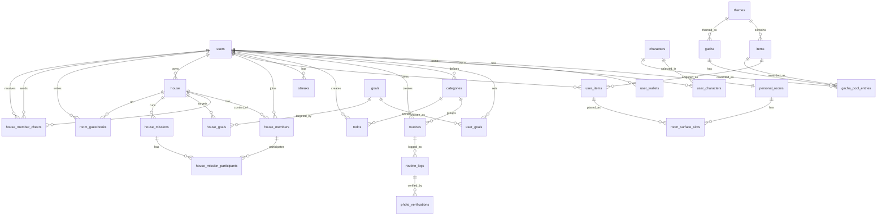

# ERD / 데이터 모델

출처: [ERDCloud — 루게더 mvp (최종)](https://www.erdcloud.com/d/Qn9GqwdWnsqsiQQpi) · 총 **27 table**.

컬럼/타입 상세는 구현 시 서버 repo의 Flyway migration에서 최종 확정한다. 이 문서는 팀이 맞춰야 하는 **table·컬럼·관계 합의안**이다.

> 표기: `*` = PK · `→table` = FK 대상 · `?` = nullable. 이미지/에셋은 전체 URL이 아니라 `*_key`(asset_key, cover_image_key, storage_key 등)로 저장한다.

## 도메인별 table

### 회원 / 재화 / 인증
- **users**: id* | nickname VARCHAR(30)? | email VARCHAR(255)? | last_accessed_at TIMESTAMP? | created_at | updated_at | deleted_at?
  - `email`은 소셜 provider가 제공/동의한 경우 저장(nullable, unique 없음 — provider 간 동일 이메일 재연결 여지).
- **oauth_accounts**: id* | user_id→users | provider VARCHAR(20) (kakao/google/apple) | provider_user_id VARCHAR(255) | created_at | unique (provider, provider_user_id)
  - 소셜 로그인. 한 user가 여러 provider 연결 가능. 인증 토큰은 JWT(stateless).
- **refresh_tokens**: id* | user_id→users | token_hash VARCHAR(255) | expires_at TIMESTAMP | revoked_at TIMESTAMP? | created_at | unique (token_hash)
  - refresh 토큰 회전(RTR) 저장소. 원문이 아니라 **해시만** 저장. 재발급 시 사용한 토큰은 `revoked_at` 기록 후 새 행으로 교체.
- **user_wallets**: id* | user_id→users | currency_type VARCHAR(30) | balance INT | created_at | updated_at
  - `currency_type`로 **코인**(루틴 실천 보상)과 **다이아**(아이템 구매)를 구분한다.

### 캐릭터 (온보딩 · 방)
- **characters**: id* | code VARCHAR(50) | name VARCHAR(100) | base_asset_key VARCHAR(255) | sort_order INT | is_active BOOLEAN
- **user_characters**: id* | user_id→users | character_id→characters | is_selected BOOLEAN | acquired_at | created_at | updated_at | deleted_at?

### 목표 (온보딩)
- **goals**: id* | code VARCHAR(50) | name VARCHAR(100) | sort_order INT | is_active BOOLEAN
- **user_goals**: id* | user_id→users | goal_id→goals | is_primary BOOLEAN | created_at

### 카테고리
- **categories**: id* | user_id→users | name VARCHAR(100) | color_hex VARCHAR(20)? | icon_key VARCHAR(100)? | sort_order INT | visibility VARCHAR(30) | created_at | updated_at | deleted_at?
  - 공개 범위는 **카테고리 단위**(`categories.visibility`: `PRIVATE`(비공개)/`FRIENDS`(친한친구)/`HOUSE`(집)/`PUBLIC`(공개), 기본 `PRIVATE`). `routines`에는 `visibility` 없음(공개는 카테고리를 따름) → ERDCloud 정본 반영 필요.

### 루틴 / 투두
- **routines**: id* | user_id→users | category_id→categories? | origin_routine_id→routines? | title VARCHAR(160) | auth_type VARCHAR(30) | status VARCHAR(30) | repeat_type VARCHAR(40)? | repeat_days JSON? | scheduled_time TIME? | starts_on DATE? | ends_on DATE? | created_at | updated_at | deleted_at?
  - `auth_type`: `CHECK`/`PHOTO`. `status`: `ACTIVE`만 유효(컬럼 VARCHAR(30)은 유지, `PAUSED`/`ARCHIVED`는 미사용). `repeat_type`: `DAILY`/`WEEKLY`/`BIWEEKLY`/`MONTHLY`/`YEARLY`, `repeat_days`(JSON): `WEEKLY`/`BIWEEKLY`일 때 `{"daysOfWeek":[...]}`, `MONTHLY`일 때 `{"dayOfMonth":N}`, `YEARLY`일 때 `{"month":M,"day":D}`. `BIWEEKLY`는 `starts_on`이 속한 주(월요일 시작)를 1주차로 삼아 2주 간격 판정하므로 `starts_on` 필수. `visibility` 없음(공개는 카테고리를 따름).
  - `origin_routine_id`: 루틴 시간버전 계보 루트(최초 생성 시 자기 자신). 스케줄 수정으로 버전이 갈려도 불변 — 완료·취소의 계보 판정(중복 완료 가드·`FAILED` 전이/복원·day-end 배치)과 같은 루틴 묶음 판별에 사용.
- **routine_logs**: id* | routine_id→routines | routine_date DATE | status VARCHAR(30) | completed_at TIMESTAMP? | reward_currency_type VARCHAR(30)? | reward_amount INT | created_at
  - `status`(`RoutineLogStatus`): `COMPLETED`/`FAILED`(미사용 잠정값 `MISSED`는 제거). `FAILED`는 day-end 배치가 기록하는 미수행 로그 — `completed_at` null, 보상 0. 늦은(과거) 완료 시 `FAILED` row는 `COMPLETED`로 전이(UPDATE)되고, 과거 수행 대상 완료를 취소하면 다시 `FAILED`로 복원된다(당일·유효기간 밖 완료의 취소는 hard delete). 과거 캘린더는 이 로그를 단독 소싱한다. unique(`routine_id`, `routine_date`)가 같은 날짜 중복 로그를 막는다(배치 멱등성의 기반).
- **photo_verifications**: id* | routine_log_id→routine_logs | storage_key VARCHAR(255) | privacy_scope VARCHAR(30) | ai_review_status VARCHAR(30) | uploaded_at | deleted_at?
  - `privacy_scope`: `categories.visibility`와 같은 값 집합(`PRIVATE`/`FRIENDS`/`HOUSE`/`PUBLIC`). 단, 사진 인증 API는 현재 미구현이며 공개 범위는 카테고리 스코프를 따르는 방향으로 검토 중(컬럼은 스키마상 유지). `ai_review_status`: AI 분석 결과용 컬럼이나 현재 범위에선 미사용(저장 시 `APPROVED` 고정, 미노출).
- **todos**: id* | user_id→users | category_id→categories? | title VARCHAR(160) | description TEXT? | due_date DATE? | due_time TIME? | status VARCHAR(30) | completed_at TIMESTAMP? | reward_currency_type VARCHAR(30)? | reward_amount INT | created_at | updated_at | deleted_at?
- **streaks**: id* | user_id→users | current_count INT | longest_count INT | last_success_date DATE? | last_evaluated_date DATE? | status VARCHAR(30) | updated_at

### 방 (개인)
- **personal_rooms**: **user_id*** (PK이자 →users, 1:1) | growth_level INT | updated_at
- **room_surface_slots**: id* | room_user_id→personal_rooms | slot_type VARCHAR(40) | user_item_id→user_items? | saved_at TIMESTAMP
- **room_guestbooks**: id* | content VARCHAR(500) | created_at | deleted_at? | room_owner_id→users | house_id→house | author_id→users

### 상점 / 아이템 / 테마
- **themes**: id* | code VARCHAR(50) | name VARCHAR(100) | cover_image_key VARCHAR(255)? | is_active BOOLEAN
- **items**: id* | theme_id→themes | category_code VARCHAR(50) | placement_type VARCHAR(40) | surface_slot_type VARCHAR(40)? | character_slot_type VARCHAR(40)? | default_slot VARCHAR(40)? (positioned 가구 기본 배치 슬롯 - 서버 관리, admin 조정) | name VARCHAR(120) | purchase_currency_type VARCHAR(30)? | price_amount INT? | asset_key VARCHAR(255) | is_limited BOOLEAN | is_active BOOLEAN
- **user_items**: id* | user_id→users | item_id→items | acquired_at | deleted_at?

### 뽑기
- **gacha**: id* | code VARCHAR(50) | name VARCHAR(120) | cost_currency_type VARCHAR(30)? | cost_amount INT | draw_count INT | starts_at TIMESTAMP? | ends_at TIMESTAMP? | is_active BOOLEAN | created_at | updated_at | theme_id→themes?
  - `theme_id`는 **NULL 허용**: 아이템 뽑기는 테마별, **캐릭터 뽑기는 테마 무관(NULL)**.
- **gacha_pool_entries**: id* | gacha_id→gacha | reward_type VARCHAR(30) | item_id→items? | character_id→characters? | currency_type VARCHAR(30)? | reward_amount INT? | rarity VARCHAR(30)? | weight INT | is_active BOOLEAN
  - `reward_type`로 아이템(`ITEM`) / 캐릭터(`CHARACTER`) / 재화(`CURRENCY`) 보상을 구분. 중복 아이템은 다이아로 전환, **중복 캐릭터는 코인 200 환급**.

### 알림
- **user_device_token**: id* | user_id→users | token VARCHAR(255) UNIQUE | platform VARCHAR(20) | created_at | updated_at
  - `platform`: `IOS`/`ANDROID`. 사용자당 여러 개(멀티디바이스) 허용. 등록은 멱등(같은 token 재등록 시 `updated_at` 갱신), 다른 사용자가 등록했던 token이면 소유자 이전(기기 재로그인).
- **notification**: id* | user_id→users | type VARCHAR(30) | title VARCHAR(255) | body VARCHAR(1000) | ref_id BIGINT? | is_read BOOLEAN | push_status VARCHAR(20) | created_at
  - 알림 내역. `type`(`NotificationType`): `HOUSE_KICK`/`ROUTINE_REMINDER`/`FRIEND_CHEER`. `ROUTINE_REMINDER` 발송은 별도 batch worker로 구현됨(5분 주기 트리거, 같은 분 재실행은 중복 발송 방지로 스킵), `FRIEND_CHEER`는 응원 API가 진입점을 같은 트랜잭션에서 직접 호출 — `HOUSE_KICK` 발송 트리거는 후속. `ref_id`는 발송 원인 리소스 ID(예: 리마인드면 routineId)로 중복 발송 판정에 쓰이며 nullable. `push_status`(`PushStatus`: `PENDING`/`SENT`/`FAILED`)는 FCM push 발송 결과를 추적한다 — 저장 시 `PENDING`, 발송 후 등록 토큰 중 1개 이상 실제 전송에 성공하면 `SENT`, 전부 실패·발송 중 예외·등록된 토큰 없음이면 `FAILED`로 갱신한다. `FAILED` 재시도는 없다. 목록 API 응답에는 노출하지 않는다. 발송은 공용 진입점 `NotificationService.send(userId, type, title, body[, refId])`가 담당하고, 알림 내역 저장(동기)과 FCM push(비동기, best-effort — 실패해도 내역은 남음)를 분리한다. FCM은 사용자 토큰 전체로 멀티캐스트 발송하고 `UNREGISTERED`/`INVALID_ARGUMENT` 응답 token은 `user_device_token`에서 삭제한다. firebase 서비스 계정 JSON은 환경변수/외부 경로로 주입(커밋 금지). 신규 엔드포인트 없음(내부 인프라).

### 집 (공동)
- **house**: id* | owner_user_id→users | name VARCHAR(120) | description TEXT? | cover_image_key VARCHAR(255)? | max_members INT? | current_member_count INT | level INT | growth_points INT | invite_code VARCHAR(50)? | invite_expires_at TIMESTAMP? | created_at | updated_at | deleted_at?
  - 초대코드는 **`house` 컬럼**(`invite_code`, `invite_expires_at`)에 둔다. `current_member_count`는 **저장**한다.
- **house_members**: id* | house_id→house | user_id→users | role VARCHAR(30) | status VARCHAR(30) | joined_at | left_at?
- **house_member_cheers**: id* | house_id→house | sender_user_id→users | target_user_id→users | cheer_type VARCHAR(20) | cheer_date DATE | created_at
  - 집 멤버 원터치 응원. `cheer_type`(`CheerType` code): `great`/`support`/`best`. `UNIQUE(sender_user_id, target_user_id, cheer_type, cheer_date)` — **house_id는 unique에서 의도적으로 제외**(같은 사용자쌍은 집과 무관하게 하루·타입당 1회, 스팸 방지). `house_id`는 어느 집 맥락에서 보냈는지 기록용. 저장 시 대상에게 `FRIEND_CHEER` 알림 내역을 같은 트랜잭션에서 저장.
- **house_goals**: id* | house_id→house | goal_id→goals
- **house_missions**: id* | house_id→house | title VARCHAR(160) | mission_type VARCHAR(50) | target_value INT | status VARCHAR(30) | starts_at? | ends_at? | created_at | deleted_at?(soft delete — 소유자 삭제, 기여 이력은 보존)
  - `mission_type`: `DAILY_MEMBER_RATE`(오늘 멤버 N% 달성) / `WEEKLY_MEMBER_COUNT`(주 N회) / `STREAK_DAYS`(N일 연속). MVP는 앞 2개. `target_value`=목표 수치. 미션 주제(운동/공부 등)는 `title`·`house_goals`로.
- **house_mission_participants**: id* | mission_id→house_missions | membership_id→house_members | contribution_value INT | reward_claimed BOOLEAN | updated_at

## 관계 다이어그램

## 확정된 모델링 결정

- 집 단체 미션 `mission_type` = `DAILY_MEMBER_RATE`/`WEEKLY_MEMBER_COUNT`/`STREAK_DAYS`(MVP는 앞 2개), `target_value`=목표 수치, 주제는 `title`·`house_goals`. 집 레벨은 미션 보상 → `growth_points` → 레벨 → 테마 해금 흐름(구체 곡선·수치는 운영 밸런스로 추후). 구성원 루틴 현황은 **기본 공개**(개인이 끌 수 있음).
- 공개 범위는 **카테고리 단위**(`categories.visibility` 추가, `routines.visibility` 제거) → ERDCloud 정본 반영 필요.
- 인증은 **소셜 로그인(카카오·구글·애플) + JWT**. 로그인 수단은 `oauth_accounts` 테이블로 분리(users엔 인증정보 안 둠) → ERDCloud 정본에 `oauth_accounts` 추가 필요.
- 사용자는 **여러 집에 동시 가입 가능**(기획서: "하나 이상의 집에 참여"). `house_members`의 unique는 `(house_id, user_id)` 조합에만 걸어 같은 집 중복 가입만 막는다 — `user_id` 단독 unique는 걸지 않는다.
- `house_goals`는 마스터 `goals`를 참조한다(집이 공통 목표 마스터 중 선택; 집이 자유 텍스트 목표를 직접 작성하는 모델이 아님).
- 초대코드: 별도 table이 아니라 `house.invite_code` / `house.invite_expires_at` 컬럼.
- `house.current_member_count`: 저장(계산 아님).
- 개인 방: `personal_rooms`는 `user_id`를 PK로 쓰는 users와 1:1.
- 방 배치(`room_surface_slots`)는 에셋이 아니라 보유 아이템(`user_items`)을 참조.
- 별도 `assets` table 없음 — 에셋 키는 `items.asset_key`, `characters.base_asset_key`, `themes.cover_image_key`, `photo_verifications.storage_key`에 분산.
- **캐릭터 획득**: 온보딩에서 6개 중 기본 1개 무료 선택, 나머지는 **캐릭터 뽑기**로 획득. 캐릭터 뽑기는 테마 무관 전용 머신(`gacha.theme_id` NULL 허용)으로, 풀 엔트리는 `reward_type = CHARACTER` + `character_id`→`characters`. 비용 코인 1000, 6개 균등, 중복 시 코인 200 환급. → `gacha_pool_entries.character_id` FK 추가 + `reward_type`에 `CHARACTER` 값 필요(ERDCloud 정본 반영 필요).

남은 미결정은 [open-questions.md](open-questions.md) 참고.
