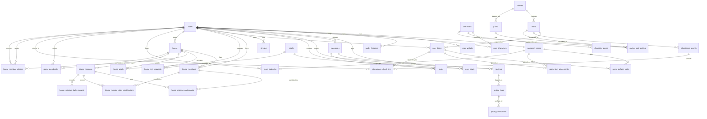

# ERD / 데이터 모델

출처: [ERDCloud — 루게더 mvp (최종)](https://www.erdcloud.com/d/Qn9GqwdWnsqsiQQpi) · 총 **37 table**(`attendance_events`·`attendance_check_ins` 포함 — ERDCloud 정본 반영 필요).

컬럼/타입 상세는 구현 시 서버 repo의 Flyway migration에서 최종 확정한다. 이 문서는 팀이 맞춰야 하는 **table·컬럼·관계 합의안**이다.

> 표기: `*` = PK · `→table` = FK 대상 · `?` = nullable. 이미지/에셋은 전체 URL이 아니라 `*_key`(asset_key, cover_image_key, storage_key 등)로 저장한다.

## 도메인별 table

### 회원 / 재화 / 인증
- **users**: id* | nickname VARCHAR(30)? | bio VARCHAR(100)? | email VARCHAR(255)? | profile_image_key VARCHAR(255)? | is_bot BOOLEAN | bot_key VARCHAR(40)? | last_accessed_at TIMESTAMP? | created_at | updated_at | deleted_at? | unique (bot_key)
  - `email`은 소셜 provider가 제공/동의한 경우 저장(nullable, unique 없음 — provider 간 동일 이메일 재연결 여지).
  - `is_bot`(기본 false)·`bot_key`는 서버가 시드하는 **동거 봇 계정** 구분용. 별도 테이블 없이 `users` 행으로 존재하며, `bot_key`는 코드 프로필 카탈로그와 1:1로 매핑되는 시드 멱등 키(일반 회원은 null). `is_bot`은 관측·보상·알림·배치·회고 격리와 응답 표시의 판정 기준 → [member/features.md](domains/member/features.md) "동거 봇 계정".
  - `bio`는 프로필 소개글(최대 100자, nullable).
  - `profile_image_key`는 프로필 사진 S3 object key(`profile/{uuid}.{ext}`). 전체 URL이 아닌 key만 저장하며, null이면 기본 이미지를 표시한다.
  - 회원탈퇴 시 `email`·`nickname`·`bio`·`profile_image_key`는 탈퇴 트랜잭션에서 즉시 null 처리(익명화)하고, 프로필 S3 원본은 커밋 후 best-effort로 삭제한다 → [member/api.md](domains/member/api.md) "회원탈퇴".
- **oauth_accounts**: id* | user_id→users | provider VARCHAR(20) (kakao/google/apple) | provider_user_id VARCHAR(255) | apple_refresh_token_encrypted VARCHAR(1000)? | created_at | unique (provider, provider_user_id)
  - 소셜 로그인. 한 user가 여러 provider 연결 가능. 인증 토큰은 JWT(stateless).
  - `apple_refresh_token_encrypted`는 provider=apple일 때만 사용 — 로그인 시 `authorizationCode`를 교환해 받은 애플 refresh token을 암호화 저장(재로그인 시 갱신), 회원탈퇴 시 revoke 호출에 사용. 탈퇴 시 row 자체를 삭제한다(재가입 = 신규 가입).
- **refresh_tokens**: id* | user_id→users | token_hash VARCHAR(255) | expires_at TIMESTAMP | revoked_at TIMESTAMP? | created_at | unique (token_hash)
  - refresh 토큰 회전(RTR) 저장소. 원문이 아니라 **해시만** 저장. 재발급 시 사용한 토큰은 `revoked_at` 기록 후 새 행으로 교체.
- **user_wallets**: id* | user_id→users | currency_type VARCHAR(30) | balance INT | created_at | updated_at | unique (user_id, currency_type)
  - unique는 동시 가입·지급의 이중 지갑 생성 방어선(`uq_user_wallets_user_currency`) — 가입 지갑 발급이 이 제약에 의존한다.
  - `currency_type`로 **코인**(루틴 실천 보상)과 **다이아**(아이템 구매)를 구분한다.
- **wallet_histories**: id* | user_id→users | currency_type VARCHAR(30) | amount INT | reason VARCHAR(30) | balance_after INT | source_type VARCHAR(30)? | source_id BIGINT? | created_at | index (user_id, id) | index (source_type, source_id)
  - 재화 증감 원장. 적립·차감을 한 테이블에 기록하며 `amount`는 적립 양수·차감 음수. **지급액 0 이벤트는 기록하지 않는다**(일일 상한 도달, 과거 완료 등).
  - `reason` 허용값 9종: `ROUTINE_COMPLETE`·`TODO_COMPLETE`·`SIGNUP_BONUS`·`GACHA_DUPLICATE_CONVERT`·`INVITE_REWARD`·`COBWEB_CLEAN`·`ATTENDANCE_REWARD`(적립) / `GACHA_DRAW`·`SHOP_PURCHASE`(차감).
  - `source_type`/`source_id`는 발생 원본 논리 참조(`ROUTINE_LOG`/`TODO`/`GACHA`/`ITEM`/`ROOM_COBWEB`/`ATTENDANCE_CHECK_IN` + 해당 id). 출석 보상은 `attendance_check_ins.id`를 기록한다. 가입 보너스·초대 보상은 원본 참조 없음(null).
  - 루틴/투두 완료 취소는 회수 row를 남기지 않고 **원 획득 row를 삭제**한다(`user_id`+`reason`+`source_type`/`source_id`로 특정 — `source_id`는 GACHA/ITEM에선 유일하지 않아 user 스코프 필수).
  - `balance_after`는 증감 직후 잔액 스냅샷으로 지갑 갱신과 **같은 트랜잭션**에서 기록한다. 위 삭제 정책과 조합하면 이후 row의 스냅샷이 사후 재계산과 다를 수 있다(허용 사양).
- **user_invite_codes**: id* | user_id→users | invite_code VARCHAR | created_at | unique (user_id), unique (invite_code)
  - 개인 친구 초대코드(집 초대코드 `house.invite_code`와 별개). 첫 조회 시 발급.
- **invite_rewards**: id* | inviter_user_id→users | invitee_user_id→users | inviter_amount INT | invitee_amount INT | created_at | unique (invitee_user_id)
  - 친구 초대 redeem 기록 — unique(invitee)로 계정당 평생 1회 보장. 보상 각 50코인, 초대자 한도 10건(초과 시 inviter_amount 0) → [member/api.md](domains/member/api.md) "친구 초대 보상".

### 캐릭터 (온보딩 · 방)
- **characters**: id* | code VARCHAR(50) | name VARCHAR(100) | base_asset_key VARCHAR(255) | sort_order INT | is_active BOOLEAN
- **character_poses**: id* | character_id→characters | code VARCHAR(40) | asset_key VARCHAR(255) | sort_order INT | is_active BOOLEAN | created_at | updated_at | unique (character_id, code) | index (character_id, is_active, sort_order)
  - 캐릭터별 추가 포즈 에셋 카탈로그. 표준 애니메이션(idle/pose-cycle/wave)은 기존 code 파생 key 규칙을 유지하고, 추가 포즈만 이 테이블로 동적 관리한다(admin 등록·수정·삭제).
- **user_characters**: id* | user_id→users | character_id→characters | is_selected BOOLEAN | acquired_at | created_at | updated_at | deleted_at?

### 목표 (온보딩)
- **goals**: id* | code VARCHAR(50) | name VARCHAR(100) | sort_order INT | is_active BOOLEAN
- **user_goals**: id* | user_id→users | goal_id→goals | is_primary BOOLEAN | created_at

### 카테고리
- **categories**: id* | user_id→users | name VARCHAR(100) | color_hex VARCHAR(20)? | icon_key VARCHAR(100)? | house_id BIGINT? | sort_order INT | visibility VARCHAR(30) | created_at | updated_at | deleted_at?
  - 공개 범위는 **카테고리 단위**(`categories.visibility`: `PRIVATE`(비공개)/`FRIENDS`(친한친구)/`HOUSE`(집)/`PUBLIC`(공개), 기본 `PRIVATE`). `routines`에는 `visibility` 없음(공개는 카테고리를 따름) → ERDCloud 정본 반영 필요.
  - `house_id`: 연동된 집(단체미션용 카테고리 표시, 추가 2026-07-29 server V35). **FK 미부여** — `house` 논리 참조. 집 탈퇴·강퇴 시 서버가 null 로 일괄 해제.

### 루틴 / 투두
- **routines**: id* | user_id→users | category_id→categories? | origin_routine_id→routines? | house_mission_id BIGINT? | title VARCHAR(160) | auth_type VARCHAR(30) | status VARCHAR(30) | repeat_type VARCHAR(40)? | repeat_days JSON? | scheduled_time TIME? | starts_on DATE? | ends_on DATE? | created_at | updated_at | deleted_at?
  - `house_mission_id`: 연동된 단체미션(오늘 완료 시 자동 기여, 추가 2026-07-29 server V35). **FK 미부여** — `house_missions` 논리 참조. 미션 삭제·집 탈퇴/강퇴 시 서버가 null 로 일괄 해제, 버전 분기 시 새 버전으로 승계.
  - `auth_type`: `CHECK`/`PHOTO`. `status`: `ACTIVE`만 유효(컬럼 VARCHAR(30)은 유지, `PAUSED`/`ARCHIVED`는 미사용). `repeat_type`: `DAILY`/`WEEKLY`/`BIWEEKLY`/`MONTHLY`/`YEARLY`, `repeat_days`(JSON): `WEEKLY`/`BIWEEKLY`일 때 `{"daysOfWeek":[...]}`, `MONTHLY`일 때 `{"dayOfMonth":N}`, `YEARLY`일 때 `{"month":M,"day":D}`. `BIWEEKLY`는 `starts_on`이 속한 주(월요일 시작)를 1주차로 삼아 2주 간격 판정하므로 `starts_on` 필수. `visibility` 없음(공개는 카테고리를 따름).
  - `origin_routine_id`: 루틴 시간버전 계보 루트(최초 생성 시 자기 자신). 스케줄 수정으로 버전이 갈려도 불변 — 완료·취소의 계보 판정(중복 완료 가드·`FAILED` 전이/복원·day-end 배치)과 같은 루틴 묶음 판별에 사용.
- **routine_logs**: id* | routine_id→routines | routine_date DATE | status VARCHAR(30) | completed_at TIMESTAMP? | reward_currency_type VARCHAR(30)? | reward_amount INT | created_at
  - `status`(`RoutineLogStatus`): `PENDING`/`COMPLETED`/`FAILED` — enum 3종이나 `PENDING`을 쓰는 경로는 현재 없다(미사용 잠정값 `MISSED`는 제거). `FAILED`는 day-end 배치가 기록하는 미수행 로그 — `completed_at` null, 보상 0. 늦은(과거) 완료 시 `FAILED` row는 `COMPLETED`로 전이(UPDATE)되고, 과거 수행 대상 완료를 취소하면 다시 `FAILED`로 복원된다(당일·유효기간 밖 완료의 취소는 hard delete). 과거 캘린더는 그제(D-2) 이전 날짜에서 이 로그를 단독 소싱한다(어제는 그날 유효 버전 재계산 + `COMPLETED` 병합 — routine-todo api.md 캘린더 참고). unique(`routine_id`, `routine_date`)가 같은 날짜 중복 로그를 막는다(배치 멱등성의 기반).
- **photo_verifications**: id* | routine_log_id→routine_logs | storage_key VARCHAR(255) | privacy_scope VARCHAR(30) | ai_review_status VARCHAR(30) | uploaded_at | deleted_at?
  - `privacy_scope`: `categories.visibility`와 같은 값 집합(`PRIVATE`/`FRIENDS`/`HOUSE`/`PUBLIC`). 단, 사진 인증 API는 현재 미구현이며 공개 범위는 카테고리 스코프를 따르는 방향으로 검토 중(컬럼은 스키마상 유지). `ai_review_status`: AI 분석 결과용 컬럼이나 현재 범위에선 미사용(enum `PENDING`/`APPROVED`/`REJECTED`, DDL 기본값 `PENDING`, 쓰기 경로 미구현·미노출).
- **todos**: id* | user_id→users | category_id→categories? | title VARCHAR(160) | description TEXT? | due_date DATE? | due_time TIME? | status VARCHAR(30) | completed_at TIMESTAMP? | reward_currency_type VARCHAR(30)? | reward_amount INT | created_at | updated_at | deleted_at? | external_source VARCHAR(30)? | external_id VARCHAR(255)? | unique (user_id, external_source, external_id)
  - `external_source`/`external_id`는 **기기 캘린더에서 가져온 일정**의 원본 참조(모바일 #844). `external_source`는 `GOOGLE_CALENDAR` 등 출처, `external_id`는 그 캘린더의 이벤트 id다. **중복 임포트를 막는 유일한 근거**이며 unique가 그 방어선이다 — 동기화는 반복 실행되므로 이 값이 없으면 같은 일정이 실행할 때마다 복제된다.
  - 사용자 단위 "연동함" 플래그로는 중복을 막을 수 없다. 어느 이벤트를 이미 가져왔는지는 **항목마다** 알아야 한다.
  - 임포트로 만들어진 뒤에는 **일반 투두와 완전히 동일하게 취급**한다 — 사용자가 카테고리를 옮기고, 제목을 고치고, 지울 수 있다. 원본 일정이 바뀌거나 지워져도 서버는 이 투두를 건드리지 않는다(사용자가 이미 손댔을 수 있다).
- **streaks**: id* | user_id→users | current_count INT | longest_count INT | last_success_date DATE? | last_evaluated_date DATE? | status VARCHAR(30) | updated_at

### 방 (개인)
- **personal_rooms**: **user_id*** (PK이자 →users, 1:1) | growth_level INT | layout_format VARCHAR(20) | layout_revision INT | updated_at
  - `layout_format`: `SLOT_V1`(기본, 슬롯 배치 정본) / `FREE_V1`(자유배치 정본). `layout_revision`은 0부터 시작하고 배치 저장 성공마다 증가한다.
- **room_surface_slots**: id* | room_user_id→personal_rooms | slot_type VARCHAR(40) | user_item_id→user_items? | saved_at TIMESTAMP | unique (room_user_id, slot_type)
  - unique는 슬롯 upsert 정합의 최후 방어선. 해제는 null 대입이 아니라 row 삭제다(빈 슬롯 row 없음).
- **room_item_placements**: id* | room_user_id→personal_rooms | user_item_id→user_items | position_x DECIMAL(6,5) | position_y DECIMAL(6,5) | z_index INT | scale DECIMAL(4,2) | rotation_deg INT | flipped BOOLEAN | updated_at TIMESTAMP | unique (room_user_id, user_item_id)
  - 자유배치 가구만 저장한다. surface 3종(벽지/바닥/배경)은 `room_surface_slots`를 계속 사용한다.
- **room_cobwebs**: **room_user_id*** (PK이자 →personal_rooms, 1:1) | appeared_at TIMESTAMP | cleaned_at TIMESTAMP? | cleaned_by_user_id→users? | updated_at TIMESTAMP | index (cleaned_at)
  - 방마다 행 1개를 재사용한다. `cleaned_at` null이면 활성 상태이고, 청소 시 시각·청소자를 기록한다. 다시 미접속 조건을 만족하면 같은 행을 새 회차로 재활성화한다.
- **room_guestbooks**: id* | content VARCHAR(500) | created_at | deleted_at? | room_owner_id→users | house_id→house | author_id→users

### 상점 / 아이템 / 테마
- **themes**: id* | code VARCHAR(50) | name VARCHAR(100) | cover_image_key VARCHAR(255)? | is_active BOOLEAN
- **items**: id* | theme_id→themes | category_code VARCHAR(50) | placement_type VARCHAR(40) (`positioned`/`surface_slot`) | surface_slot_type VARCHAR(40)? (`wallpaper`/`floor`/`background`) | character_slot_type VARCHAR(40)? | default_slot VARCHAR(40)? (positioned 가구 기본 배치 슬롯 - 서버 관리, admin 조정) | default_scale DECIMAL(4,2) (새 배치 초기 렌더 배율, 기본 1.00, admin 조정 범위 0.50~2.00, 기존 배치 비소급) | default_position_x DECIMAL(6,5)? | default_position_y DECIMAL(6,5)? | name VARCHAR(120) | purchase_currency_type VARCHAR(30)? | price_amount INT? | asset_key VARCHAR(255) | is_limited BOOLEAN | is_active BOOLEAN
  - `default_position_x`·`default_position_y`는 positioned 가구를 새 `FREE_V1` 배치에 추가할 때 쓰는 중심점 기준 기본 좌표(각 0.0~1.0)다. 두 값은 함께 null이거나 함께 값이 있어야 하며, null 쌍이면 클라이언트 공통 기본 위치를 사용한다. 기존 `room_item_placements`에는 소급하지 않는다.
- **user_items**: id* | user_id→users | item_id→items | acquired_at | deleted_at? | unique (user_id, item_id)
- **user_character_accessories**: id* | user_character_id→user_characters | user_item_id→user_items | character_slot_type VARCHAR(40) | equipped_at TIMESTAMP | unique (user_character_id, character_slot_type) | unique (user_character_id, user_item_id)
  - 캐릭터별 슬롯 착용 상태. 같은 슬롯 적용은 기존 row를 교체하고, 캐릭터 선택을 바꿔도 row를 유지한다. `character_slot_type`은 적용 시 `items.character_slot_type`을 복사하며 클라이언트 입력값을 신뢰하지 않는다.
- **character_accessory_render_profiles**: id* | item_id→items | character_id→characters | render_state VARCHAR(40) | asset_key VARCHAR(255) | canvas_width INT | canvas_height INT | asset_width INT | asset_height INT | position_x DECIMAL(6,5) | position_y DECIMAL(6,5) | width_ratio DECIMAL(5,4) | rotation_deg INT | z_index INT | created_at | updated_at | unique (item_id, character_id, render_state)
  - 캐릭터 원본 캔버스 위에 단품 악세사리를 합성하기 위한 카탈로그 메타데이터. 캔버스·단품 이미지 크기는 양수이고, 좌표는 중심점 기준 정규화 값이다. `default` 상태가 있으면 해당 아이템을 해당 캐릭터에 착용할 수 있으며, 포즈별 상태는 동일한 `(item, character)`의 `default` 값을 선택적으로 대체한다.

### 연속 출석 이벤트
- **attendance_events**: id* | code VARCHAR(50) | title VARCHAR(120) | starts_on DATE | ends_on DATE | target_days INT | daily_coin_amount INT | bonus_day INT | bonus_coin_amount INT | reward_item_id→items | is_active BOOLEAN | created_at | unique (code) | index (is_active, starts_on, ends_on)
  - 첫 이벤트는 `target_days=10`, `daily_coin_amount=30`, `bonus_day=5`, `bonus_coin_amount=50`이다. `bonus_coin_amount`는 추가분이 아니라 해당 일차의 총 지급량이다.
- **attendance_check_ins**: id* | event_id→attendance_events | user_id→users | attendance_date DATE | streak_day INT | coin_reward_amount INT | reward_user_item_id→user_items? | reward_newly_granted BOOLEAN? | reward_processed_at TIMESTAMP? | created_at | unique (event_id, user_id, attendance_date) | index (user_id, event_id, attendance_date)
  - 출석일은 KST 서버 날짜다. `coin_reward_amount`에는 실제 지급한 코인을 저장한다. 목표 전에는 가구 보상 3개 컬럼이 모두 null이고, 완료 row에서는 모두 값이 있다.

### 뽑기
- **gacha**: id* | code VARCHAR(50) | name VARCHAR(120) | cost_currency_type VARCHAR(30)? | cost_amount INT | draw_count INT | starts_at TIMESTAMP? | ends_at TIMESTAMP? | is_active BOOLEAN | created_at | updated_at | theme_id→themes?
  - `theme_id`는 **NULL 허용**: 아이템 뽑기는 테마별, **캐릭터 뽑기는 테마 무관(NULL)**.
- **gacha_pool_entries**: id* | gacha_id→gacha | reward_type VARCHAR(30) | item_id→items? | character_id→characters? | currency_type VARCHAR(30)? | reward_amount INT? | rarity VARCHAR(30)? | weight INT | is_active BOOLEAN
  - `rarity`는 한글 `일반`/`희귀`/`전설` 3종(추첨은 티어 롤 70/25/5 — gacha 도메인 참고). `weight`·`currency_type`·`reward_amount`는 잔존 컬럼으로 런타임 미사용(`CURRENCY` 엔트리는 풀에서 제외됨).
  - `reward_type`로 아이템(`ITEM`) / 캐릭터(`CHARACTER`) / 재화(`CURRENCY`) 보상을 구분. 중복 아이템은 다이아로 전환, **중복 캐릭터는 코인 100 환급**.

### 알림
- **user_device_token**: id* | user_id→users | token VARCHAR(255) UNIQUE | platform VARCHAR(20) | created_at | updated_at
  - `platform`: `IOS`/`ANDROID`. 사용자당 여러 개(멀티디바이스) 허용. 등록은 멱등(같은 token 재등록 시 `updated_at` 갱신), 다른 사용자가 등록했던 token이면 소유자 이전(기기 재로그인).
- **notification**: id* | user_id→users | type VARCHAR(30) | title VARCHAR(255) | body VARCHAR(1000) | ref_id BIGINT? | is_read BOOLEAN | push_status VARCHAR(20) | created_at
  - 알림 내역. `type`(`NotificationType`): `HOUSE_KICK`/`ROUTINE_REMINDER`/`TODO_REMINDER`/`FRIEND_CHEER`/`HOUSE_MISSION_ACHIEVED`/`HOUSE_MEMBER_JOINED`/`HOUSE_MEMBER_LEFT`. `ROUTINE_REMINDER`·`TODO_REMINDER` 발송은 공용 batch worker(`reminderJob`)로 구현됨(5분 주기 트리거, 루틴 적재 → 투두 적재 → 발송 순, 같은 분 재실행·당일 기발송 건은 중복 발송 방지로 스킵), `FRIEND_CHEER`는 응원 API가 진입점을 같은 트랜잭션에서 직접 호출, `HOUSE_MISSION_ACHIEVED`는 미션 기여 공용부(`HouseMissionService.recordContribution` — 기여 API·연동 루틴 자동 기여 양쪽)가 미션 행 락 트랜잭션 안에서 진입점을 직접 호출한다(WEEKLY 한정, 합산이 처음 목표치 도달하는 순간 1회, 집 활성 멤버 전원 대상, `ref_id` = missionId), `HOUSE_MEMBER_JOINED`/`HOUSE_MEMBER_LEFT`는 가입 확정·탈퇴 트랜잭션이 나머지 ACTIVE 멤버 전원에게 발송한다(`ref_id` = membershipId) — `HOUSE_KICK` 발송 트리거는 후속. `ref_id`는 발송 원인 리소스 ID(예: 루틴 리마인드면 routineId, 투두 리마인드면 todoId, 입주·퇴거면 membershipId)로 중복 발송 판정에 쓰이며 nullable. `push_status`(`PushStatus`: `PENDING`/`SENT`/`BLOCKED`/`FAILED`)는 FCM push 발송 결과를 추적한다 — 저장 시 `PENDING`, 발송 후 등록 토큰 중 1개 이상 실제 전송에 성공하면 `SENT`, 사용자가 `notification_setting`으로 해당 알림을 꺼서 발송하지 않으면 `BLOCKED`, 전부 실패·발송 중 예외·등록된 토큰 없음이면 `FAILED`로 갱신한다. `BLOCKED`는 설정에 따른 정상 종결이라 발송 실패(`FAILED`)와 구분한다. `FAILED` 재시도는 없다. 목록 API 응답에는 노출하지 않는다. 발송은 공용 진입점 `NotificationService.send(userId, content[, refId])`(`content` = `NotificationContent`(type·title·body) 레코드, 문구는 `NotificationMessages` 팩토리 소유)가 담당하고, 알림 내역 저장(동기)과 FCM push(비동기, best-effort — 실패해도 내역은 남음)를 분리한다. FCM은 사용자 토큰 전체로 멀티캐스트 발송하고 `UNREGISTERED`/`INVALID_ARGUMENT` 응답 token은 `user_device_token`에서 삭제한다. firebase 서비스 계정 JSON은 환경변수/외부 경로로 주입(커밋 금지). 신규 엔드포인트 없음(내부 인프라).

- `ROOM_COBWEB_CLEANED`는 같은 집 구성원이 거미줄을 청소했을 때 방 주인에게 저장·push하며 `ref_id`는 방 주인 user id다.
- **notification_setting**: id* | user_id→users | type VARCHAR(30) | enabled BOOLEAN | created_at | updated_at
  - 사용자별 알림 설정. `UNIQUE(user_id, type)`. `type`은 개별 `NotificationType`이 아니라 **설정 그룹**(`NotificationSettingType`): `ALL`(전체 마스터)/`REMINDER`(리마인더)/`HOUSE`(집 알림). 그룹 매핑은 `REMINDER` ← `ROUTINE_REMINDER`·`TODO_REMINDER`, `HOUSE` ← `HOUSE_KICK`·`FRIEND_CHEER`·`HOUSE_MISSION_ACHIEVED`·`HOUSE_MEMBER_JOINED`·`HOUSE_MEMBER_LEFT`. **행이 없으면 ON**이 기본값이라 off로 바꿀 때만 행이 생긴다(신규 가입자는 행 0개). off는 FCM push만 차단하고 `notification` 저장은 항상 수행한다(차단된 건은 `notification.push_status`가 `BLOCKED`로 종결된다). 게이트는 push가 나가는 모든 경로에 적용된다 — 공용 진입점 `NotificationService.send(...)`뿐 아니라 batch worker가 직접 발송하는 리마인드(`ROUTINE_REMINDER`·`TODO_REMINDER`) 경로도 포함하며, 판정 규칙은 domain 모듈의 `NotificationPushPolicy` 하나를 공유한다. 마스터(`ALL`) off면 그룹 값과 무관하게 모든 push가 차단되며, 그룹별 값은 보존되어 마스터를 다시 켜면 이전 설정이 복원된다.

### 집 (공동)
- **house**: id* | owner_user_id→users | name VARCHAR(120) | description TEXT? | cover_image_key VARCHAR(255)? | max_members INT? | current_member_count INT | level INT | growth_points INT | invite_code VARCHAR(50)? | invite_expires_at TIMESTAMP? | created_at | updated_at | deleted_at?
  - 초대코드는 **`house` 컬럼**(`invite_code`, `invite_expires_at`)에 둔다. `current_member_count`는 **저장**한다.
- **house_members**: id* | house_id→house | user_id→users | role VARCHAR(30) | status VARCHAR(30) | joined_at | left_at? | invite_code VARCHAR(50)? | invite_expires_at TIMESTAMP? | sort_order INT?
  - `sort_order`는 **집 탭에서 내 집이 보이는 순서**다. 멤버십 행에 두므로 사용자별 개인 설정이며 같은 집의 다른 구성원에게 영향을 주지 않는다. 0부터 오름차순. NULL은 "아직 정렬한 적 없음"이라 뒤로 밀리고 그 안에서는 `joined_at` 오름차순 — 새로 가입한 집이 기존 순서를 흐트러뜨리지 않고 끝에 붙는다.
- **house_join_requests**: id* | house_id→house | user_id→users | status VARCHAR(30)(PENDING/ACCEPTED/REJECTED) | requested_at | processed_at?
  - 탐색 입주 신청 이력. `UNIQUE(house_id, user_id)`로 중복 행을 막고, 거절 뒤 재신청은 기존 행을 PENDING으로 되돌린다. 초대코드 즉시가입 또는 방장 수락 시 ACCEPTED, 방장 거절 시 REJECTED로 종결한다.
- **house_member_cheers**: id* | house_id→house | sender_user_id→users | target_user_id→users | cheer_type VARCHAR(20) | cheer_date DATE | daily_seq INT | created_at | unique (sender_user_id, target_user_id, cheer_type, cheer_date, daily_seq)
  - `daily_seq`는 하루 5회 한도의 회차(1~5) — unique가 동시 요청의 한도 초과를 DB 레벨에서 방어한다.
  - 집 멤버 원터치 응원. `cheer_type`(`CheerType` code): `great`/`support`/`best`. **house_id는 unique에서 의도적으로 제외**(같은 사용자쌍은 집과 무관하게 하루·타입당 5회 합산, 스팸 방지). `house_id`는 어느 집 맥락에서 보냈는지 기록용. 저장 시 대상에게 `FRIEND_CHEER` 알림 내역을 같은 트랜잭션에서 저장.
- **house_goals**: id* | house_id→house | goal_id→goals
- **house_missions**: id* | house_id→house | title VARCHAR(160) | mission_type VARCHAR(50) | target_value INT | status VARCHAR(30) | starts_at? | ends_at? | created_at | deleted_at?(soft delete — 소유자 삭제, 기여 이력은 보존)
  - `mission_type`: `DAILY_MEMBER_RATE`(오늘 멤버 달성률 % — 매일 반복, target 1~100) / `WEEKLY_MEMBER_COUNT`(기여 누적 카운트, target 1~1000) / `STREAK_DAYS`(N일 연속). MVP는 앞 2개. 미션 주제(운동/공부 등)는 `title`·`house_goals`로.
- **house_mission_participants**: id* | mission_id→house_missions | membership_id→house_members | contribution_value INT | reward_claimed BOOLEAN | updated_at
- **house_mission_daily_contributions**: id* | mission_id→house_missions | membership_id→house_members | contribution_date DATE | created_at
  - 일별 기여 이력(유형 공통). UNIQUE(mission_id, membership_id, contribution_date)가 KST 하루 1회 기여의 DB 방어선이며, DAILY 미션의 "오늘 기여 멤버 수" 판정 소스.
- **house_mission_daily_rewards**: id* | mission_id→house_missions | reward_date DATE | claimed_membership_id→house_members | created_at
  - DAILY 미션의 일별 보상 지급 이력. UNIQUE(mission_id, reward_date)가 하루 1회 claim 의 DB 방어선.
- **bug_reports**: id* | user_id→users | title VARCHAR(100) | content VARCHAR(2000) | app_version? | device_info? | status VARCHAR(30)(RECEIVED/IN_PROGRESS/RESOLVED) | created_at | updated_at
- **bug_report_images**: id* | bug_report_id→bug_reports | storage_key VARCHAR(255) | sort_order INT

### 공통 (운영)
- **banned_words**: id* | word VARCHAR(50) | created_at | unique (word)
  - 금칙어 사전 — 닉네임·bio·집 이름·방명록·미션 제목 검사(`*_BANNED` 400)의 소스.

## 관계 다이어그램

```mermaid
erDiagram
    users ||--|| personal_rooms : has
    users ||--o{ user_wallets : owns
    users ||--o{ wallet_histories : logs
    users ||--o{ user_characters : owns
    users ||--o{ user_goals : sets
    users ||--o{ categories : defines
    users ||--o{ routines : creates
    users ||--o{ todos : creates
    users ||--o{ streaks : has
    users ||--o{ user_items : owns
    users ||--o{ house_members : joins
    users ||--o{ house_join_requests : requests
    users ||--o{ house : owns

    characters ||--o{ user_characters : selected_in
    characters ||--o{ character_poses : poses
    goals ||--o{ user_goals : chosen_as
    goals ||--o{ house_goals : targeted_by

    categories ||--o{ routines : groups
    categories ||--o{ todos : groups
    routines ||--o{ routine_logs : logged_as
    routine_logs ||--o{ photo_verifications : verified_by

    personal_rooms ||--o{ room_surface_slots : has
    user_items ||--o{ room_surface_slots : placed_as
    personal_rooms ||--o{ room_item_placements : has
    user_items ||--o{ room_item_placements : placed_as
    personal_rooms ||--o| room_cobwebs : has
    users ||--o{ room_cobwebs : cleans
    users ||--o{ room_guestbooks : writes

    themes ||--o{ items : contains
    items ||--o{ user_items : acquired_as
    items ||--o{ attendance_events : rewarded_by
    attendance_events ||--o{ attendance_check_ins : records
    users ||--o{ attendance_check_ins : checks_in
    user_items ||--o{ attendance_check_ins : rewarded_as
    gacha ||--o{ gacha_pool_entries : has
    items ||--o{ gacha_pool_entries : rewarded_as
    characters ||--o{ gacha_pool_entries : rewarded_as
    themes ||--o{ gacha : themed_as

    house ||--o{ house_members : has
    house ||--o{ house_join_requests : receives
    house ||--o{ house_member_cheers : context_of
    users ||--o{ house_member_cheers : sends
    users ||--o{ house_member_cheers : receives
    house ||--o{ house_goals : targets
    house ||--o{ house_missions : runs
    house ||--o{ room_guestbooks : on
    house_missions ||--o{ house_mission_participants : has
    house_members ||--o{ house_mission_participants : participates
    house_missions ||--o{ house_mission_daily_contributions : records
    house_members ||--o{ house_mission_daily_contributions : contributes
    house_missions ||--o{ house_mission_daily_rewards : rewards
```

## 확정된 모델링 결정

- 집 단체 미션 `mission_type` = `DAILY_MEMBER_RATE`/`WEEKLY_MEMBER_COUNT`/`STREAK_DAYS`(MVP는 앞 2개), 주제는 `title`·`house_goals`. WEEKLY 는 누적 카운트(target 1~1000, 1회 claim +100 → COMPLETED), DAILY 는 일일 달성률 %(target 1~100, 매일 claim +20 반복 — 일별 이력·보상 테이블로 판정). 집 레벨은 미션 보상 → `growth_points` → 레벨 → 테마 해금 흐름(구체 곡선·수치는 운영 밸런스로 추후). 구성원 루틴 현황은 **기본 공개**(개인이 끌 수 있음).
- 공개 범위는 **카테고리 단위**(`categories.visibility` 추가, `routines.visibility` 제거) → ERDCloud 정본 반영 필요.
- 인증은 **소셜 로그인(카카오·구글·애플) + JWT**. 로그인 수단은 `oauth_accounts` 테이블로 분리(users엔 인증정보 안 둠) → ERDCloud 정본에 `oauth_accounts` 추가 필요.
- 사용자는 **여러 집에 동시 가입 가능**(기획서: "하나 이상의 집에 참여"). `house_members`의 unique는 `(house_id, user_id)` 조합에만 걸어 같은 집 중복 가입만 막는다 — `user_id` 단독 unique는 걸지 않는다.
- 집 가입은 **초대코드 즉시가입 / 탐색 입주 신청 후 방장 승인**으로 분리한다. 신청 상태는 `house_join_requests`에 두어 실제 구성원(`house_members`)과 구성원 수에 섞이지 않게 한다.
- `house_goals`는 마스터 `goals`를 참조한다(집이 공통 목표 마스터 중 선택; 집이 자유 텍스트 목표를 직접 작성하는 모델이 아님).
- 초대코드: 별도 table이 아니라 컬럼. 집 공용 코드는 `house.invite_code`/`house.invite_expires_at`(즉시가입), 구성원 개인 코드는 `house_members.invite_code`/`house_members.invite_expires_at`(참여 시 방장 승인 대기). 두 `invite_code` 는 각각 UNIQUE 이고, 발급 시 두 테이블을 함께 존재 검사해 교차 중복을 회피한다(사전 검사 기반, 테이블 간 원자적 제약은 아님).
- `house.current_member_count`: 저장(계산 아님).
- 개인 방: `personal_rooms`는 `user_id`를 PK로 쓰는 users와 1:1.
- 방 배치(`room_surface_slots`)는 에셋이 아니라 보유 아이템(`user_items`)을 참조.
- 방 자유배치는 `room_item_placements`에 보유 아이템과 정규화 좌표·z-index·scale·rotation·flip을 저장한다. 같은 보유 아이템은 한 방에 한 번만 배치할 수 있다.
- 배치 정본은 `personal_rooms.layout_format`이 결정한다. `SLOT_V1` 방만 자유배치 첫 저장 시 `FREE_V1`으로 지연 전환하며, surface 3종은 형식과 무관하게 `room_surface_slots`에 남는다.
- 별도 `assets` table 없음 — 에셋 키는 `items.asset_key`, `characters.base_asset_key`, `themes.cover_image_key`, `photo_verifications.storage_key`에 분산.
- **캐릭터 획득**: 온보딩에서 8개 중 기본 1개 무료 선택, 나머지는 **캐릭터 뽑기**로 획득. 캐릭터 뽑기는 테마 무관 전용 머신(`gacha.theme_id` NULL 허용)으로, 풀 엔트리는 `reward_type = CHARACTER` + `character_id`→`characters`. 비용 코인 500, 8개 균등, 중복 시 코인 100 환급. → `gacha_pool_entries.character_id` FK 추가 + `reward_type`에 `CHARACTER` 값 필요(ERDCloud 정본 반영 필요).
- **캐릭터 악세사리 획득**: `items.placement_type = character`인 아이템은 직접 구매하지 않고 테마별 뽑기에서 `reward_type = ITEM`으로 획득한다. 풀 엔트리는 `rarity = NULL`, `weight = 1`로 균등 추첨하며 중복 시 다른 아이템과 동일하게 다이아 3을 환급한다.

남은 미결정은 [open-questions.md](open-questions.md) 참고.
